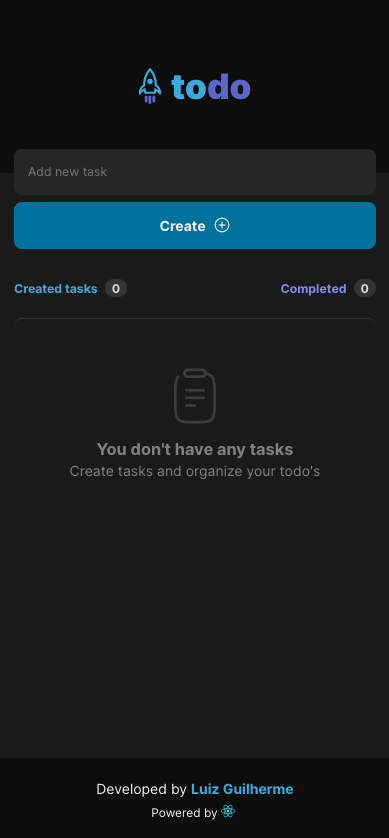
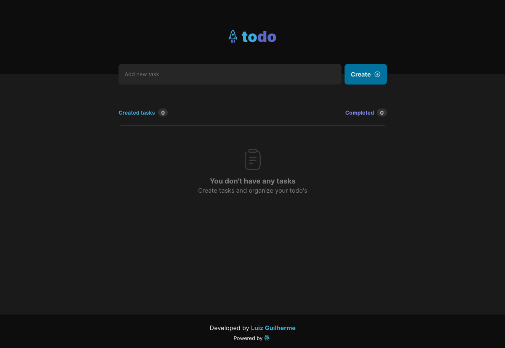

<h1 align="center">ToDo's</h1>

  

## About
React project where the user is able to create taks and keep track of how many has been created, and how many has been completed.

## ✨ Live project
<a href="https://luizpelegrini.github.io/reactjs-todo/" target="_blank">https://luizpelegrini.github.io/reactjs-todo/</a>

 

### 🧑‍💻 What I learn
* Find the minimal but complete representation of UI state
* Identifying where the component state should live
* Customizing checkbox appearance
* Inversion data flow from child components back to parent component

 

---

 

    <b>Mobile</b>

  

    <b>Desktop</b>

    

 

---

 

## 🚀 How to run:

- Clone this repository.
- Run `npm install`.
- Run `npm run dev` to start the local server.
